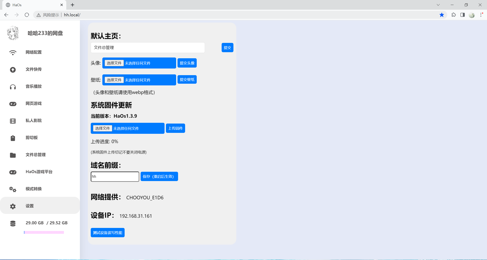

# ESP32随身网盘
项目名称：ESP32随身网盘

作者：B站 哈哈233jpg

项目实现文件管理、开机自连WIFI、设置、网页游戏、播放视频、模式转换、剪切板功能

成品尺寸:4\*3(3.1)\*1.18cm。

# 相关链接：

哔哩哔哩视频：https://www.bilibili.com/video/BV1FJ4m137nA/

立创开源广场：https://oshwhub.com/haha233.jpg/esp32-pian-xie-sd-tf-ka-fu-wu-qi_copy_copy_copy

# 个人博客：

https://hehao666.github.io/

# 使用指南：

arduino的esp32版本为3.0.0

内存卡数据的config文件夹中的`config.txt`文件`hostName`对应我们的域名前缀，修改这里即可修改后台网址。

~~~
autoWifinum=1
wifiConnectTime=500
hostName=esp32
FirstWebis=1
~~~

# 功能

1、文件总管理

2、文件快传

3、网络配置

4、设置

5、私人影院

6、剪切板

7、网页游戏

8、音乐播放

